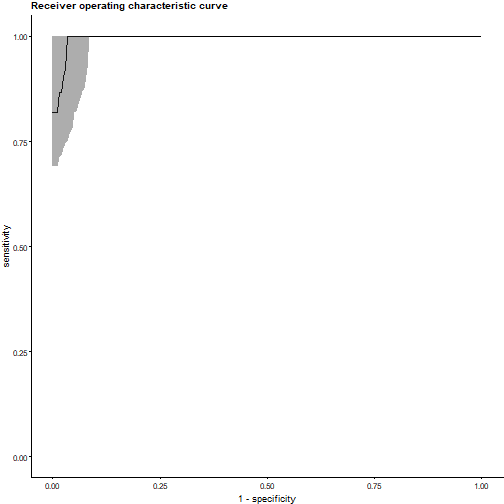
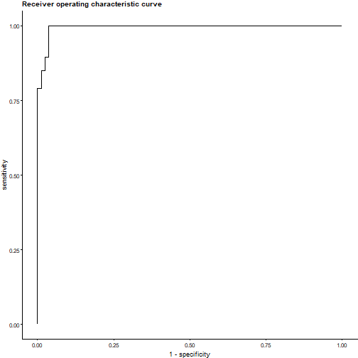
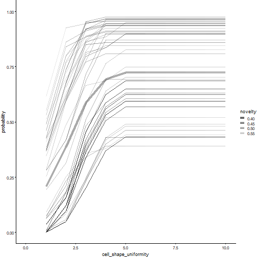
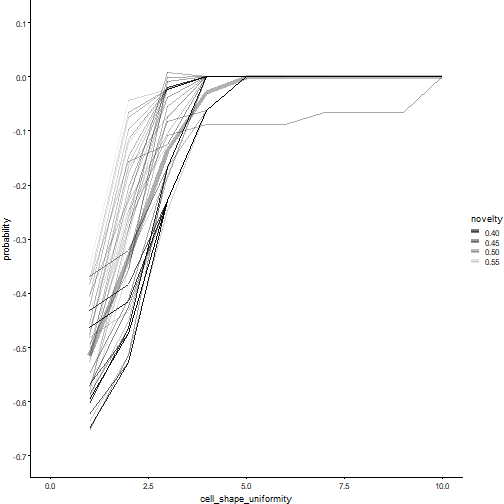

Evaluation and explanation
================
Alex Zwanenburg
2022-01-27


-   [Model performance](#model-performance)
    -   [Receiver-operating characteristic
        curve](#receiver-operating-characteristic-curve)
    -   [Precision-recall curve](#precision-recall-curve)
    -   [Confusion matrix](#confusion-matrix)
    -   [Kaplan-Meier survival curves](#kaplan-meier-survival-curves)
-   [Model calibration](#model-calibration)
    -   [Implementation details](#implementation-details)
-   [Decision curve analysis](#decision-curve-analysis)
-   [Variable importance](#variable-importance)
    -   [Model-specific methods](#model-specific-methods)
    -   [Permutation variable
        importance](#permutation-variable-importance)
-   [Partial dependence and individual conditional expectation
    plots](#partial-dependence-and-individual-conditional-expectation-plots)
-   [Feature and sample similarity](#feature-and-sample-similarity)
-   [References](#references)

``` r
library(familiar)
library(data.table)
#> data.table 1.14.2 using 12 threads (see ?getDTthreads).  Latest news: r-datatable.com

set.seed(19)
```

Familiar will automatically evaluate created models, and export
corresponding tables and plots. The table below lists all available
analyses. Several analyses allow for determining distributions and
confidence intervals to provide an indication of the value spread for a
given dataset and models (if applicable). The `estimation_type` argument
defines this behaviour:

-   `point`: Compute point estimates, i.e. single values.

-   `bias_correction` or `bc`: Bias-corrected estimates. A
    bias-corrected estimate is computed from (at least) 20 point
    estimates.

-   `bootstrap_confidence_interval` or `bci`: Bias-corrected estimates
    with bootstrap confidence intervals (Efron and Hastie 2016). This
    estimation type allows for plotting confidence intervals in plots.
    The number of point estimates required depends on the
    `confidence_level` parameter. Familiar uses a rule of thumb of
    *n* = 20/(1−confidence_level), i.e. at least 400 points for
    `confidence_level=0.95`.

Another argument, `detail_level` determines how the required point
estimates are formed:

-   `ensemble`: Point estimates are computed at the ensemble level,
    i.e. over all models in the ensemble. This means that, for example,
    bias-corrected estimates of model performance are assessed by
    creating (at least) 20 bootstraps and computing the model
    performance of the ensemble model for each bootstrap.

-   `hybrid`: Point estimates are computed from the models in an
    ensemble. This means that, for example, bias-corrected estimates of
    model performance are directly computed using the models in the
    ensemble. If there are at least 20 trained models in the ensemble,
    performance is computed for each model, in contrast to `ensemble`
    where performance is computed for the ensemble of models. If there
    are less than 20 trained models in the ensemble, bootstraps are
    created so that at least 20 point estimates can be made.

-   `model`: Point estimates are computed at the model level. This means
    that, for example, bias-corrected estimates of model performance are
    assessed by creating (at least) 20 bootstraps and computing the
    performance of the model for each bootstrap. Familiar will not
    automatically create plots in this case.

The more point estimates are required, the more computationally
intensive the analysis is. Some analyses also become computationally
more expensive with more samples. The `sample_limit` argument can be
used to specify the maximum number of samples that should be used.

Some analyses, such as model predictions and individual conditional
expectation plots, do not benefit from bootstraps as they are solely
based on values predicted by the (ensemble) models. If you want to
compute bias-corrected estimates or bootstrap confidence intervals for
these analyses you should ensure that sufficient models are created.
Experimental designs such as `experiment_design="bs(fs+mb,400)+ev"`
allow for this, but are computationally expensive.

| Name                                              | Plot function                                                                     | Export function                       | Estimation type | Detail level | Sample limit |
|---------------------------------------------------|-----------------------------------------------------------------------------------|---------------------------------------|:---------------:|:------------:|:------------:|
| AUC-PR<sup>a</sup>                                | `plot_auc_precision_recall_curve`                                                 | `export_auc_data`                     |        ×        |      ×       |              |
| AUC-ROC<sup>a</sup>                               | `plot_auc_roc_curve`                                                              | `export_auc_data`                     |        ×        |      ×       |              |
| Calibration info<sup>c</sup>                      |                                                                                   | `export_calibration_info`             |                 |      ×       |              |
| Confusion matrix<sup>a</sup>                      | `plot_confusion_matrix`                                                           | `export_confusion_matrix_data`        |                 |      ×       |              |
| Decision curve analysis<sup>ab</sup>              | `plot_decision_curve`                                                             | `export_decision_curve_analysis_data` |        ×        |      ×       |              |
| Feature expression<sup>c</sup>                    | `plot_sample_clustering`                                                          | `export_feature_expressions`          |                 |              |              |
| Feature selection variable importance<sup>c</sup> | `plot_feature_selection_occurrence`; `plot_feature_selection_variable_importance` | `export_fs_vimp`                      |                 |              |              |
| Feature similarity<sup>c</sup>                    | `plot_feature_similarity`                                                         | `export_feature_similarity`           |        ×        |              |              |
| Hyperparameters<sup>c</sup>                       |                                                                                   | `export_hyperparameters`              |                 |              |              |
| Individual conditional expectation<sup>c</sup>    | `plot_ice`                                                                        | `export_ice_data`                     |  ×<sup>d</sup>  |      ×       |      ×       |
| Model calibration<sup>ce</sup>                    | `plot_calibration_data`                                                           | `export_calibration_data`             |        ×        |      ×       |              |
| Model performance<sup>c</sup>                     | `plot_model_performance`                                                          | `export_model_performance`            |        ×        |      ×       |              |
| Model predictions<sup>c</sup>                     |                                                                                   | `export_prediction_data`              |  ×<sup>d</sup>  |      ×       |              |
| Model variable importance<sup>ce</sup>            | `plot_model_signature_occurrence`; `plot_model_signature_variable_importance`     | `export_model_vimp`                   |                 |              |              |
| Partial dependence<sup>c</sup>                    | `plot_pd`                                                                         | `export_partial_dependence_data`      |  ×<sup>d</sup>  |      ×       |      ×       |
| Permutation variable importance<sup>c</sup>       | `plot_permutation_variable_importance`                                            | `export_permutation_vimp`             |        ×        |      ×       |              |
| Risk stratification info<sup>b</sup>              |                                                                                   | `export_risk_stratification_info`     |                 |      ×       |              |
| Risk stratification data<sup>b</sup>              | `plot_kaplan_meier`                                                               | `export_risk_stratification_data`     |                 |      ×       |              |
| Sample similarity<sup>c</sup>                     |                                                                                   | `export_sample_similarity`            |        ×        |              |      ×       |
| Univariate analysis<sup>c</sup>                   | `plot_univariate_importance`                                                      | `export_univariate_analysis_data`     |                 |              |              |

Evaluation and explanation steps.  
<sup>a</sup> Available for binomial and multinomial outcomes.  
<sup>b</sup> Available for survival outcomes.  
<sup>c</sup> Available for all outcomes.  
<sup>d</sup> Estimation types other than `point` require sufficient
models.  
<sup>e</sup> May not be available for all models.

When familiar is run from `summon_familiar` plots and tables are
exported automatically. The corresponding plot and export functions can
all be used externally as well, as is described in the *Using familiar
prospectively* vignette. Indeed, to showcase some of the functionality
we will employ the techniques discussed there.

We will first create two models. We train the first model using (a
subset of) the Wisconsin breast cancer dataset (Wolberg and Mangasarian
1990) to predict cell malignancy from biopsies, which constitutes a
classification problem.

``` r
# Get a dataset.
binomial_data <- familiar:::test.create_good_data_set(outcome_type="binomial")

# Call familiar to create models. Note that we skip hyperparameter optimisation by manually defining the hyperparameters, and that we skip evaluation steps. This is to save time when creating the vignette.
familiar::summon_familiar(data=binomial_data,
                          project_dir=file.path(tempdir()),
                          experiment_dir="binomial",
                          experimental_design="fs+mb",
                          cluster_method="none",
                          fs_method="none",
                          hyperparameter=list("random_forest_ranger"=
                                                list("n_tree"=4,
                                                     "sample_size"=0.7,
                                                     "m_try"=0.5,
                                                     "node_size"=20,
                                                     "tree_depth"=3)),
                          learner="random_forest_ranger",
                          parallel=FALSE,
                          skip_evaluation_elements="all")

# Create path to the directory containing the models.
model_directory_path <- file.path(tempdir(), "binomial", "trained_models", "random_forest_ranger", "none")
model_path <- file.path(model_directory_path, list.files(model_directory_path, pattern="model")[1])

# Load the model.
binomial_model <- readRDS(model_path)
```

The second model is a survival model, and is trained on (a subset of) a
colon chemotherapy clinical trial dataset (Moertel et al. 1995) to
predict overall survival after treatment.

``` r
# Get a dataset.
survival_data <- familiar:::test.create_good_data_set(outcome_type="survival")

# Call familiar to create models. Note that we skip hyperparameter optimisation by manually defining the hyperparameters, and that we skip evaluation steps. This is to save time when creating the vignette.
familiar::summon_familiar(data=survival_data,
                          project_dir=file.path(tempdir()),
                          experiment_dir="survival",
                          experimental_design="fs+mb",
                          cluster_method="none",
                          fs_method="none",
                          hyperparameter=list("random_forest_ranger"=
                                                list("n_tree"=9,
                                                     "sample_size"=0.95,
                                                     "m_try"=0.68,
                                                     "node_size"=30,
                                                     "tree_depth"=2,
                                                     "alpha"=0.25)),
                          learner="random_forest_ranger",
                          parallel=FALSE,
                          skip_evaluation_elements="all")

# Create path to the directory containing the models.
model_directory_path <- file.path(tempdir(), "survival", "trained_models", "random_forest_ranger", "none")
model_path <- file.path(model_directory_path, list.files(model_directory_path, pattern="model")[1])

# Load the model.
survival_model <- readRDS(model_path)
```

# Model performance

We assess model performance to evaluate accuracy of a model. Model
accuracy is quantified using performance metrics that are documented in
the *Performance metrics* vignette, and can be set using the
`evaluation_metric` argument of the `summon_familiar` function or
`metric` for plot and export functions. For example, this results in the
following plot for the breast cancer dataset:

``` r
plots <- familiar::plot_model_performance(object=binomial_model,
                                          data=binomial_data,
                                          metric = c("auc", "brier", "f1_score"),
                                          x_axis_by="metric")

plots[[1]]
```


The plot shows distributions of the area under the receiver operating
characteristic curve, the brier score and the f1-score. The plot
indicates that the model predicts accurately for the given dataset. This
behaviour is expected: The classification problem is quite easy, and we
are evaluating the development dataset.

To compute model performance metric scores for a dataset, familiar first
predicts expected values for instances in a dataset. Familiar then
compares the expected values against the observed values, and computes
the value of the specified metric.

## Receiver-operating characteristic curve

The receiver-operating characteristic (ROC) curve visualises concordance
between predicted class probabilities and the observed classes (Hand and
Till 2001). It shows the trade-off between sensitivity and specificity
of the model. The receiver-operating characteristic curve for the breast
cancer dataset is as follows:

``` r
plots <- familiar::plot_auc_roc_curve(object=binomial_model,
                                      data=binomial_data)

plots[[1]]
```



Under ideal circumstances, the curve would lie in the top-left corner of
the plot. If a model does not predict better than at random, the curve
would lie along the diagonal, which corresponds to an AUC-ROC value of
0.50. The plot above indicates that the model can differentiate between
benign and malignant cells in breast cancer biopsy.

Familiar creates an ROC curve by ascendingly sorting instances by the
predicted probability of the positive class, and computing the number of
true positive, true negative, false positive, false negative cases
observed at each instance. These are then used to compute sensitivity
and specificity.

The above plot shows the average of 400 single curves, with 95%
confidence intervals. To achieve this, familiar interrogates each curve
over the complete range of potential specificity values
(\[0.000,1.000\]) with a step size of 0.005. Linear interpolation is
used for this purpose (Davis and Goadrich 2006). This allows for
assessing the distribution of sensitivity at fixed specificity values.

The above approach is the general approach used by familiar. However,
familiar will plot an exact ROC curve if the point estimate
(`estimation_type="point"`) of a single model or the complete ensemble
of models is evaluated (`detail_level="ensemble"`):

``` r
plots <- familiar::plot_auc_roc_curve(object=binomial_model,
                                      data=binomial_data,
                                      estimation_type="point")

plots[[1]]
```



Note that we did not specify the detail level to create the above plot
because only a single model is evaluated.

## Precision-recall curve

The precision-recall (PR) curve shows the trade-off between precision
(positive predictive value) and recall (sensitivity). An important
distinction between the PR curve and the ROC curve described above is
that precision does not assess true negatives but false positives. In
case the number of negative instances greatly exceeds the number of
positive instances, a large change in the number of false positives
reduces the ROC curve somewhat, but this change is far easier observed
in the PR curve (Davis and Goadrich 2006). Hence the PR curve is
commonly assessed if the positive class is more important than and rare
compared to the negative class. For the breast cancer dataset, the
precision-recall curve is as follows:

``` r
plots <- familiar::plot_auc_precision_recall_curve(object=binomial_model,
                                                   data=binomial_data)

plots[[1]]
```


Under ideal circumstances, the curve would lie in the top-right part of
the plot. A random classifier would yield a curve that is mostly
horizontal and located at the fraction of positive instances. This would
equal a precision of 45% for the current dataset.

Like the ROC curve, familiar forms the PR curve by ascendingly sorting
instances by the predicted probability of the positive class and
computing the number of true positive and false positive negative cases
observed at each instance. These values are then used to compute recall
and precision.

The above plot shows the average of 400 single curves, with 95%
confidence intervals. To achieve this, familiar interrogates each curve
over the complete range of recall values (\[0.000,1.000\]) with a step
size of 0.005. We use linear interpolation for this purpose, treating
the PR curve as a piecewise function to manage the situation identified
by Davis and Goadrich (Davis and Goadrich 2006). Interpolating in this
manner allows for assessing the distribution of precision values at
fixed recall values.

Again, this is the general approach used by familiar. Familiar can plot
an exact PR curve when evaluating the point estimate
(`estimation_type="point"`) of a single model or of the complete
ensemble of models (`detail_level="ensemble"`). In the breast cancer
dataset, this produces the following curve:

``` r
plots <- familiar::plot_auc_precision_recall_curve(object=binomial_model,
                                                   data=binomial_data,
                                                   estimation_type="point")

plots[[1]]
```


## Confusion matrix

A confusion matrix schematically represents the number of predicted
(expected) class instances and their actual (observed) values. This may
help identify potential weaknesses of classifiers, i.e. false positives
or negatives.

``` r
plots <- familiar::plot_confusion_matrix(object=binomial_model,
                                         data=binomial_data)

plots[[1]]
```


Familiar selects the class with the highest predicted class probability
as the expected class. It is currently not possible in familiar to
obtain confusion matrices for set probability thresholds, such as the
threshold that maximises the Matthews correlation coefficient.

## Kaplan-Meier survival curves

Kaplan-Meier survival curves are a standard method for assessing
survival over time in a population, or for assessing survival
differences between groups.

Familiar applies one or more thresholds to stratify instances to risk
groups. These thresholds are created during model development to avoid
bias. The number and value of these thresholds is determined by two
parameters: `stratification_method` and `stratification_threshold`. Both
parameters are set when calling `summon_familiar`.
`stratification_method` has three options:

-   `median`: Familiar uses the median predicted value in the
    development cohort to stratify instances into two risk groups.

-   `fixed`: Instances are stratified based on the sample quantiles of
    the predicted values. These quantiles are defined using the
    `stratification_threshold` parameter.

-   `optimised`: Use maximally selected rank statistics to determine the
    optimal threshold (Lausen and Schumacher 1992; Hothorn and
    Lausen 2003) to stratify instances into two optimally separated risk
    groups.

The `stratification_threshold` parameter is only used when
`stratification_method="fixed"`. It allows for specifying the sample
quantiles that are used to determine the thresholds. For example
`stratification_threshold=c(0.25,0.75)` creates two thresholds that
stratifies the development dataset into three groups: one with 25% of
the instances with the highest risk, a group with 50% of the instances
with medium risk, and a third group with 25% of instances with lowest
risk.

Applying the survival model to the colon cancer dataset yields the
following Kaplan-Meier plot:

``` r
plots <- familiar::plot_kaplan_meier(object=survival_model,
                                     data=survival_data)

grid::grid.newpage()
grid::grid.draw(plots[[1]])
```


In the plot above, familiar divides instances into two groups by the
median threshold in the development dataset. The risk groups are shown
with 95% confidence intervals. Familiar uses the `survival::survfit`
function to create both the survival curves and the confidence
intervals. The low-risk group has significantly better survival than the
high-risk group. This is also indicated in the bottom-left of the main
plot, which shows the result of a logrank test between the two groups.
Crosses indicate right-censored patients, of which there were few. The
number of surviving patients in both groups at the time points along the
x-axis are shown below the main plot.

Note that the `predict` method allows for manually specifying
stratification thresholds for existing models.

# Model calibration

Evaluating model performance is important as it allows us to assess how
accurate a model is. However, it often does not tell us how well we can
rely on predictions for individual instances, e.g. how accurate an
instance class probability is. Model calibration is assessed for this
purpose. The model for the breast cancer dataset produces the following
calibration plot:

``` r
plots <- familiar::plot_calibration_data(object=binomial_model,
                                         data=binomial_data)

grid::grid.newpage()
grid::grid.draw(plots[[1]])
```


The calibration curve shows the expected (predicted) probability of
malignant cells versus the observed proportion of malignant cells,
together with a 95% confidence interval. In an ideal calibration plot
the calibration curve should lie on the diagonal (dashed) line. Here the
upper part of the curve (expected probability \> 0.50) follows the
diagonal nicely. The lower part of the curve dips below the diagonal,
indicating that predicted probabilities in this range tend to
overestimate malignancy. However, the density plot in the top panel
indicates that predicted probabilities were generally close to 0.0 or
1.0, with very few instances in between.

Familiar also performs several calibration tests to assess various
degrees of calibration (Van Calster et al. 2016). First of all, we
assess two aspects of the linear fit (solid line in the plot): the
intercept (calibration-in-the-large) and slope. These are shown in the
top-left of the main plot.

The intercept ideally is 0.00. In our example, it lies below this point,
and is not contained in the 95% confidence interval. We therefore
conclude that the intercept is significantly different at the *α* = 0.05
level. Note that this difference may not be relevant in practice, as it
is quite small.

In an ideal case, the slope of the linear fit is 1.00. In our example,
the slope of the linear fit lies above this value. This indicates that,
overall, the model tends to overestimate the probability of malignant
cells, but not to a large degree.

One issue with assessing calibration through a linear fit, is that the
calibration curve can be decidedly non-linear and still produce good
values for the intercept and slope. Therefore, we also assess
calibration using statistical goodness-of-fit tests: the Hosmer-Lemeshow
(HL) test for categorical and regression outcomes (Hosmer et al. 1997),
and the Nam-D’Agostino (ND) (D’Agostino and Nam 2003) and
Greenwood-Nam-D’Agostino (GND) (Demler, Paynter, and Cook 2015) tests
for survival outcomes.

## Implementation details

Here we detail the implementation of the model calibration in familiar.
The statistical tests mentioned above, as well as the linear fit, rely
on grouping instances. First we order the instances in the dataset by
their expected (predicted) values. Within each group, the expected
values and observed values are compared:

-   Categorical outcomes: We compare the fraction instances with the
    (positive) observed class in the group against the mean expected
    probability for that same class.

-   Regression outcomes: Both expected and observed values are first
    normalised to a \[0,1\] range using the value range observed in the
    development dataset. We then compare the mean observed value in the
    group against the mean expected value.

-   Survival outcomes: We predict survival probabilities at time points
    indicated by `evaluation_times`. The mean expected survival
    probability in the group is then compared against the observed
    probability (Kaplan-Meier estimator) at the same time points.

We can observe the points thus created in a calibration plot when
`estimation_type="point"`:

``` r
plots <- familiar::plot_calibration_data(object=binomial_model,
                                         data=binomial_data,
                                         estimation_type="point")

grid::grid.newpage()
grid::grid.draw(plots[[1]])
```


The plot with point estimates and the earlier calibration plot with
bootstrap confidence intervals lead to the same assessment. However, you
may have observed that the number of points, and thus the number of
groups, is certainly larger than the 10 groups commonly formed for
assessing calibration. This is correct.

Familiar introduces randomness into the assessment of calibration.
First, familiar randomises the number of groups drawn because using a
fixed number of 10 groups is arbitrary. Second, the actual group sizes
are randomised by drawing group identifiers with replacement for all
instances. We then sort the set of drawn identifiers, and the instances,
ordered by increasing expected value, are then assigned to their
respective group. Thirdly, this process is repeated multiple times,
i.e. 20 times for point estimates, again 20 times (on bootstraps) for
bias-corrected estimates and more for bootstraps confidence intervals.

Linear fit intercept and slope as well as the goodness-of-fit test
p-value are determined for each single set of groups. Intercept and
slopes are then averaged (`point` and `bias_correction`) or assessed as
a distribution (`bootstrap_confidence_interval`). p-values from
goodness-of-fit tests need to be combined. These tests are not fully
independent because they derive from the same dataset. We therefore
compute a harmonic mean p-value (Wilson 2019) from the individual
p-values.

# Decision curve analysis

Decision curve analysis is a method to assess the net (clinical) benefit
of models, introduced by Vickers and Elkin (Vickers and Elkin 2006). The
decision curve compares the model benefit for different threshold
probabilities against two or more options. The two standard options are
that all instances receive an intervention, and none receive an
intervention. What constitutes an intervention is model-dependent
(Vickers, Calster, and Steyerberg 2019). For our breast cancer cohort,
intervention might constitute treatment of all patients, versus no
treatment and treatment for patients with malignancy predicted by the
model. This produces the following figure:

``` r
plots <- familiar::plot_decision_curve(object=binomial_model,
                                       data=binomial_data,
                                       y_range=c(-0.2, 0.5))

plots[[1]]
#> Warning: Removed 1 row(s) containing missing values (geom_path).

#> Warning: Removed 1 row(s) containing missing values (geom_path).
```


The shaded curve is the decision curve produced by the model, with 95%
confidence intervals. The declining curve represents the intervention
for all, which offers no benefit for a malignancy probability of 45%.
The horizontal line at a net benefit of 0.0 represent the no
intervention option. As may be observed, the model offers a net benefit
over the entire range of threshold probabilities.

For regression problems no definition of decision curves exists.
However, familiar can perform decision curve analysis for survival
outcomes, based on Vickers et al. (Vickers et al. 2008).

# Variable importance

Not all features are strongly associated with the outcome of interest.
One of the most critical points in machine learning is selecting those
features that are important enough to incorporate into a model. Familiar
prospectively assesses variable importance during the feature selection
step using the methods detailed in the *Feature selection methods*
vignette. Later, during evaluation, familiar employs both model-specific
and model-agnostic methods to explaining which features are considered
important by the model itself.

## Model-specific methods

Model-specific methods rely on aspects of the models themselves to
determine variable importance. For instance, the coefficients of
regression models are a measure of variable importance when features are
normalised. In the case of the random forest model for the breast cancer
dataset, permutation variable importance is determined. This produces
the following plot:

``` r
plots <- familiar::plot_model_signature_variable_importance(object=binomial_model,
                                                            data=binomial_data)

plots[[1]]
```


In such plots, we always order features so that the most important
features are on the left, and the least important features on the right.

In case an ensemble of models is assessed, scores are aggregated using
an aggregation method (see the *feature selection methods* vignette).
This method can be set using the `aggregation_method` argument, or the
`eval_aggregation_method` configuration parameter (`summon_familiar`).

The `plot_model_signature_occurrence` method plots the occurrence of
features among the first 5 ranks across an ensemble of models (if
available). The rank threshold can be specified using the
`rank_threshold` argument or the `eval_aggregation_rank_threshold`
parameter (`summon_familiar`).

## Permutation variable importance

Permutation variable importance is a model-agnostic variable importance
method. It assesses importance by measuring the decrease in model
performance caused by shuffling values of a feature across the instances
in a dataset.

For the breast cancer dataset, this results in the following figure:

``` r
plots <- familiar::plot_permutation_variable_importance(object=binomial_model,
                                                        data=binomial_data,
                                                        estimation_type="bias_correction")

plots[[1]]
```


The figure shows the features along the y-axis, and the loss in AUC-ROC
caused by permuting the feature values along the x-axis. Accordingly,
`cell_shape_uniformity` is considered to be the most important feature
in the model.

The figure shows two bars for each feature. A well-known issue with
permutation variable importance is that the presence of highly
correlated features causes permutation variable importance to become
unreliable (Hooker, Mentch, and Zhou 2019). If two features are both
important and highly correlated, shuffling one of them does not decrease
model performance as much. For this reason, familiar will permute
features together depending on their mutual correlation, and the
provided threshold values.

By default, similarity between features is assessed using McFadden’s
pseudo-*R*<sup>2</sup>. This metric can assess similarity between
different types of features, i.e. numeric and categorical. The default
thresholds are 0.3 and 1.0 that respectively cluster highly similar
features and permute all features individually.

The breast cancer dataset doesn’t contain features that exceed the
relatively stringent threshold of 0.3. Since the breast cancer dataset
has only numerical features, we can also measure similarity differently.
For example, if we measure similarity using the Spearman\`s rank
correlation coefficient, we arrive at the following:

``` r
plots <- familiar::plot_permutation_variable_importance(object=binomial_model,
                                                        data=binomial_data,
                                                        estimation_type="bias_correction",
                                                        feature_similarity_metric="spearman",
                                                        feature_similarity_threshold=c(0.6, 1.0))

plots[[1]]
```


This figure paints a different picture: the `cell_shape_uniformity`,
`bare_nuclei`, `normal_nucleoli` and `epithelial_cell_size` features are
moderately to strongly correlated. When permuted together, this has a
major effect on model performance. This can also be observed in the
performance decrease caused by shuffling `cell_shape_uniformity` alone,
which only partially matches the performance decrease caused by
shuffling the 4 features. The other 3 features have little individual
impact on performance, yet shuffling them together directly shows that
these features are important as well.

# Partial dependence and individual conditional expectation plots

Variable importance does not explain how features influence the model.
Partial dependence (PD) (Friedman 2001) and individual conditional
expectation (ICE) (Goldstein et al. 2015) plots can be used to visualise
this behaviour. As an example, we can create an ICE plot for the
`cell_shape_uniformity` feature that was found to be important for
predicting cell malignancy in the breast cancer.

``` r
plots <- familiar::plot_ice(object=binomial_model,
                            data=binomial_data,
                            features="cell_shape_uniformity")

grid::grid.newpage()
grid::grid.draw(plots[[1]])
```



The ICE plot shows multiple curves for individual samples, as well as
their average, the partial dependence plot as a somewhat thicker curve.
The ICE plot indicates that an increase in cell shape uniformity is
associated by the model with a rise in malignancy.

It also shows novelty, which is a measure of how out-of-distribution the
value is. Novelty is computed using extended isolation forests (Hariri,
Carrasco Kind, and Brunner 2019) and is the average normalised height at
which a sample is found in a terminal leaf node of the trees in the
isolation forest (Liu, Ting, and Zhou 2008). Novelty values range
between `0.00` and `1.00`. Novelty values should be interpreted with
care. While increasing novelty values represent instances that lie
further from the distribution, the values that represent in-distribution
instances may vary. In the ICE plot above, novelty values range between
`0.40` and `0.60`. In fact, the median novelty value for the training
instances is `0.47` with an interquartile range of `0.07`. None of the
points in ICE plot can therefore be considered out-of-distribution.

It is possible to anchor the curves in the ICE plot to a specific
feature value. This allows for assessing the model response for
individual instances versus a fixed value. In effect this can reduce
some of the offset caused by other (fixed) features in each instance,
and may help to elucidate the observed behaviour:

``` r
plots <- familiar::plot_ice(object=binomial_model,
                            data=binomial_data,
                            features="cell_shape_uniformity",
                            anchor_values=list("cell_shape_uniformity"=10.0))

grid::grid.newpage()
grid::grid.draw(plots[[1]])
```



In the plot above, we have anchored the values at
`cell_shape_uniformity=10`, which is the maximum value that this feature
can take. All curves are then drawn relative to the predicted
probability found for this particular value.

It is also possible to show the partial dependence of two features at
the same time:

``` r
plots <- familiar::plot_ice(object=binomial_model,
                            data=binomial_data,
                            features=c("cell_shape_uniformity", "bare_nuclei"))

grid::grid.newpage()
grid::grid.draw(plots[[1]])
```


The partial dependence plot above shows the `cell_shape_uniformity`
along the x-axis and `bare_nuclei` along the y-axis. Higher intensities
are associated with a higher expected probability of malignancy. The
figure thus indicates that higher values of `cell_shape_uniformity`
clearly affect the predicted malignancy probability. Higher values of
`bare_nuclei` also lead to higher malignancy probabilities, but the
effect is less pronounced. The average novelty score of the underlying
instances determines the size of each point.

It also possible to anchor 2D partial dependence plots:

``` r
plots <- familiar::plot_ice(object=binomial_model,
                            data=binomial_data,
                            features=c("cell_shape_uniformity", "bare_nuclei"),
                            anchor_values=list("cell_shape_uniformity"=10.0,
                                               "bare_nuclei"=10.0),
                            show_novelty=FALSE)

grid::grid.newpage()
grid::grid.draw(plots[[1]])
```


We disabled novelty (`show_novelty=FALSE`) for plotting the 2D anchored
plot. This changes the appearance of the plot, which now consists of
coloured rectangles. The white dots show the position at which familiar
samples the feature values.

Familiar automatically determines the values at which numerical features
are sampled based on their distribution in the development dataset. Such
values can also be manually set using the `feature_x_range` and
`feature_y_range` arguments. Whereas for the breast cancer dataset the
features are linearly sampled, for the `nodes` feature in the colon
cancer dataset this is not the case:

``` r
plots <- familiar::plot_ice(object=survival_model,
                            data=survival_data,
                            features=c("nodes", "rx"),
                            evaluation_times=1000,
                            show_novelty=FALSE)

grid::grid.newpage()
grid::grid.draw(plots[[1]])
```


Here we see that the number of nodes was not sampled linearly. Survival
probability at 1000 days drops with an increase in nodes. Moreover, the
model predicts that patients in the Levamisole `Lev` and observation
`Obs` arms have lower survival probabilities overall.

# Feature and sample similarity

Highly similar features can carry redundant information for a model.
This can be visualised using similarity heatmaps:

``` r
plots <- familiar::plot_feature_similarity(object=binomial_model,
                                           data=binomial_data,
                                           feature_similarity_metric="spearman")

grid::grid.newpage()
grid::grid.draw(plots[[1]])
```


The heatmap displays Spearman’s correlation coefficient between the
different features. The features are also ordered by similarity, so that
clusters of similar features can be identified. Note that the
dendrograms depict cluster distance, i.e. 1 − \|*ρ*\| for Spearman’s
correlation coefficient.

It is also possible to view the sample clustering. This can be used to
identify if samples are readily stratified into clusters, which may or
may not correlate to the endpoint of interest. For the breast cancer
dataset, this yields the following heatmap:

``` r
plots <- familiar::plot_sample_clustering(object=binomial_model,
                                          data=binomial_data,
                                          feature_similarity_metric="spearman")

grid::grid.newpage()
grid::grid.draw(plots[[1]])
```


As may be observed, samples in the breast cancer dataset form two main
clusters that correspond closely to cell malignancy. The top dendrogram
is the same as for feature clustering, as it should be. The right
dendrogram is formed after computing Gower’s distance between samples
(by default), and shows the division of samples into two main clusters.
The heatmap itself shows normalised values for the features, based on
normalisation and transformation parameters obtained during model
development.

Normalisation options can be altered by changing the
`show_normalised_data` argument. In the breast cancer dataset all
features have the same range, so we can also show the data directly:

``` r
plots <- familiar::plot_sample_clustering(object=binomial_model,
                                          data=binomial_data,
                                          feature_similarity_metric="spearman",
                                          show_normalised_data="none")

grid::grid.newpage()
grid::grid.draw(plots[[1]])
```


# References

<div id="refs" class="references csl-bib-body hanging-indent">

<div id="ref-DAgostino2003-ot" class="csl-entry">

D’Agostino, R B, and Byung-Ho Nam. 2003. “Evaluation of the Performance
of Survival Analysis Models: Discrimination and Calibration Measures.”
In *Handbook of Statistics*, 23:1–25. Elsevier.
<https://doi.org/10.1016/S0169-7161(03)23001-7>.

</div>

<div id="ref-Davis2006-xb" class="csl-entry">

Davis, Jesse, and Mark Goadrich. 2006. “The Relationship Between
Precision-Recall and ROC Curves.” In *Proceedings of the 23rd
International Conference on Machine Learning*, 233–40. ICML ’06. New
York, NY, USA: Association for Computing Machinery.
<https://doi.org/10.1145/1143844.1143874>.

</div>

<div id="ref-Demler2015-yx" class="csl-entry">

Demler, Olga V, Nina P Paynter, and Nancy R Cook. 2015. “Tests of
Calibration and Goodness-of-Fit in the Survival Setting.” *Stat. Med.*
34 (10): 1659–80. <https://doi.org/10.1002/sim.6428>.

</div>

<div id="ref-Efron2016-ws" class="csl-entry">

Efron, Bradley, and Trevor Hastie. 2016. *Computer Age Statistical
Inference*. Cambridge University Press.

</div>

<div id="ref-Friedman2001-jf" class="csl-entry">

Friedman, Jerome H. 2001. “Greedy Function Approximation: A Gradient
Boosting Machine.” *Ann. Stat.* 29 (5): 1189–1232.

</div>

<div id="ref-Goldstein2015-rv" class="csl-entry">

Goldstein, Alex, Adam Kapelner, Justin Bleich, and Emil Pitkin. 2015.
“Peeking Inside the Black Box: Visualizing Statistical Learning with
Plots of Individual Conditional Expectation.” *J. Comput. Graph. Stat.*
24 (1): 44–65. <https://doi.org/10.1080/10618600.2014.907095>.

</div>

<div id="ref-Hand2001-il" class="csl-entry">

Hand, David J, and Robert J Till. 2001. “A Simple Generalisation of the
Area Under the ROC Curve for Multiple Class Classification Problems.”
*Mach. Learn.* 45 (2): 171–86.
<https://doi.org/10.1023/A:1010920819831>.

</div>

<div id="ref-Hariri2019-xz" class="csl-entry">

Hariri, S, M Carrasco Kind, and R J Brunner. 2019. “Extended Isolation
Forest.” *IEEE Trans. Knowl. Data Eng.*, 1–1.
<https://doi.org/10.1109/TKDE.2019.2947676>.

</div>

<div id="ref-Hooker2019-pv" class="csl-entry">

Hooker, Giles, Lucas Mentch, and Siyu Zhou. 2019. “Unrestricted
Permutation Forces Extrapolation: Variable Importance Requires at Least
One More Model, or There Is No Free Variable Importance,” May.
<https://arxiv.org/abs/1905.03151>.

</div>

<div id="ref-Hosmer1997-ov" class="csl-entry">

Hosmer, D W, T Hosmer, S Le Cessie, and S Lemeshow. 1997. “A Comparison
of Goodness-of-Fit Tests for the Logistic Regression Model.” *Stat.
Med.* 16 (9): 965–80.
[https://doi.org/10.1002/(sici)1097-0258(19970515)16:9\<965::aid-sim509>3.0.co;2-o](https://doi.org/10.1002/(sici)1097-0258(19970515)16:9<965::aid-sim509>3.0.co;2-o).

</div>

<div id="ref-Hothorn2003-qn" class="csl-entry">

Hothorn, Torsten, and Berthold Lausen. 2003. “On the Exact Distribution
of Maximally Selected Rank Statistics.” *Comput. Stat. Data Anal.* 43
(2): 121–37. <https://doi.org/10.1016/S0167-9473(02)00225-6>.

</div>

<div id="ref-Lausen1992-qh" class="csl-entry">

Lausen, Berthold, and Martin Schumacher. 1992. “Maximally Selected Rank
Statistics.” *Biometrics* 48 (1): 73. <https://doi.org/10.2307/2532740>.

</div>

<div id="ref-Liu2008-kw" class="csl-entry">

Liu, F T, K M Ting, and Z Zhou. 2008. “Isolation Forest.” In *2008
Eighth IEEE International Conference on Data Mining*, 413–22.
<https://doi.org/10.1109/ICDM.2008.17>.

</div>

<div id="ref-Moertel1995-bh" class="csl-entry">

Moertel, C G, T R Fleming, J S Macdonald, D G Haller, J A Laurie, C M
Tangen, J S Ungerleider, et al. 1995. “Fluorouracil Plus Levamisole as
Effective Adjuvant Therapy After Resection of Stage III Colon Carcinoma:
A Final Report.” *Ann. Intern. Med.* 122 (5): 321–26.
<https://doi.org/10.7326/0003-4819-122-5-199503010-00001>.

</div>

<div id="ref-Van_Calster2016-ok" class="csl-entry">

Van Calster, Ben, Daan Nieboer, Yvonne Vergouwe, Bavo De Cock, Michael J
Pencina, and Ewout W Steyerberg. 2016. “A Calibration Hierarchy for Risk
Models Was Defined: From Utopia to Empirical Data.” *J. Clin.
Epidemiol.* 74 (June): 167–76.
<https://doi.org/10.1016/j.jclinepi.2015.12.005>.

</div>

<div id="ref-Vickers2019-ar" class="csl-entry">

Vickers, Andrew J, Ben van Calster, and Ewout W Steyerberg. 2019. “A
Simple, Step-by-Step Guide to Interpreting Decision Curve Analysis.”
*Diagn Progn Res* 3 (1): 18.
<https://doi.org/10.1186/s41512-019-0064-7>.

</div>

<div id="ref-Vickers2008-uu" class="csl-entry">

Vickers, Andrew J, Angel M Cronin, Elena B Elkin, and Mithat Gonen.
2008. “Extensions to Decision Curve Analysis, a Novel Method for
Evaluating Diagnostic Tests, Prediction Models and Molecular Markers.”
*BMC Med. Inform. Decis. Mak.* 8 (November): 53.
<https://doi.org/10.1186/1472-6947-8-53>.

</div>

<div id="ref-Vickers2006-be" class="csl-entry">

Vickers, Andrew J, and Elena B Elkin. 2006. “Decision Curve Analysis: A
Novel Method for Evaluating Prediction Models.” *Med. Decis. Making* 26
(6): 565–74. <https://doi.org/10.1177/0272989X06295361>.

</div>

<div id="ref-Wilson2019-bi" class="csl-entry">

Wilson, Daniel J. 2019. “The Harmonic Mean p-Value for Combining
Dependent Tests.” *Proc. Natl. Acad. Sci. U. S. A.* 116 (4): 1195–1200.
<https://doi.org/10.1073/pnas.1814092116>.

</div>

<div id="ref-Wolberg1990-gn" class="csl-entry">

Wolberg, W H, and O L Mangasarian. 1990. “Multisurface Method of Pattern
Separation for Medical Diagnosis Applied to Breast Cytology.” *Proc.
Natl. Acad. Sci. U. S. A.* 87 (23): 9193–96.
<https://doi.org/10.1073/pnas.87.23.9193>.

</div>

</div>

<div class="footer">
<br>
<a rel="license" href="https://creativecommons.org/licenses/by/4.0/"></a>
This work is licensed under a <a rel="license" href="https://creativecommons.org/licenses/by/4.0/">Creative Commons Attribution 4.0 International License</a>.
Cite as: Alex Zwanenburg. familiar: Vignettes and Documentation (2021). <a href="https://github.com/alexzwanenburg/familiar">https://github.com/alexzwanenburg/familiar</a>
</div>
