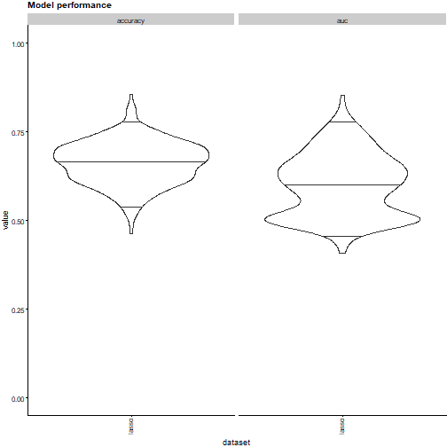
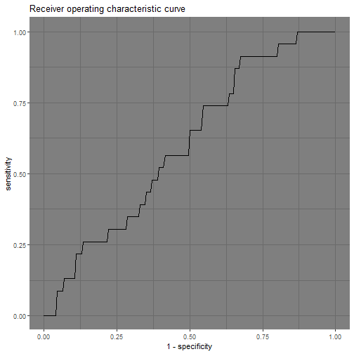

Using familiar prospectively
================
Alex Zwanenburg
2022-01-27


-   [Using models prospectively](#using-models-prospectively)
-   [Using ensembles of models
    prospectively](#using-ensembles-of-models-prospectively)
-   [Customising exports and plots](#customising-exports-and-plots)
    -   [Exporting collections](#exporting-collections)

``` r
library(familiar)
library(data.table)
#> data.table 1.14.2 using 12 threads (see ?getDTthreads).  Latest news: r-datatable.com

set.seed(19)
```

The `summon_familiar` function is used to generate models for a given
dataset and provide a broad analysis afterwards. This creates a number
of files. Many of the files resulting from this analysis can also be
used outside of `summon_familiar`. For example, models and ensembles can
be used prospectively to assess new datasets. Likewise, data and
collection objects can be used to customise plotting and export to
tables.

In this example we will use the *birthweight* dataset collected in 1986
at Baystate Medical Center, Springfield, Massachusetts. This dataset
contains birth weight data from 189 newborn children, some of which have
low birth weight (less then 2.5 kg). Potential risk factors were also
collected. We will try to predict the low birth weight indicator using
these risk factors.

We will first randomly split the data into development and validation
datasets:

``` r
# Load the birth weight data set
data <- data.table::as.data.table(MASS::birthwt)

# Add sample and batch identifiers.
data[,":="("sample_id"=.I)]

# Generate training and validation samples
train_samples <- sample(data$sample_id, size=120, replace=FALSE)
valid_samples <- setdiff(data$sample_id, train_samples)

# Assign batch identifiers.
data[sample_id %in% train_samples, "batch_id":="development"]
data[sample_id %in% valid_samples, "batch_id":="validation"]
```

Next we will prepare the dataset further. We drop the `bwt` column as
this directly contains the indicator we are trying to predict. Other
columns are encoded as categorical variables.

``` r
# Drop the bwt column.
data[, "bwt":=NULL]

# Encode the low outcome column: we ensure that "low" is now the so-called
# positive class.
data$low <- factor(data$low, levels=c(0, 1), labels=c("normal", "low"))

# Encode race. smoke, ht, and ui columns as categorical variables.
data$race <- factor(data$race, levels=c(1, 2, 3), labels=c("white", "black", "other"))
data$smoke <- factor(data$smoke, levels=c(0, 1), labels=c("no", "yes"))
data$ht <- factor(data$ht, levels=c(0, 1), labels=c("no", "yes"))
data$ui <- factor(data$ui, levels=c(0, 1), labels=c("no", "yes"))

# Rename columns to make them clearer.
data.table::setnames(data,
                     old=c("low", "age", "lwt", "race", "smoke", "ptl", "ht", "ui", "ftv"),
                     new=c("birth_weight", "age_mother", "weight_mother_before_pregnancy",
                           "ethnicity", "smoking_during_pregnancy", "previous_premature_labours",
                           "hypertension_history", "uterine_irritability", "physician_visits_first_trimester"))
```

Then we call `summon_familiar` create models for the data and assess
these. We will create an ensemble of five penalised logistic regression
models to predict the low birth weight indicator, based on bootstraps of
the development dataset. You may notice that we here write to the
temporary R directory using the `tempdir()` function. In practice you
will want to use a different directory, as the temporary R directory
will be deleted once your R session closes. For speed, we will also only
compute point estimates during evaluation (see the *evaluation and
explanation* vignette for other options).

``` r
familiar::summon_familiar(data=data,
                          project_dir=tempdir(),
                          sample_id_column="sample_id",
                          batch_id_column="batch_id",
                          development_batch_id="development",
                          outcome_type="binomial",
                          outcome_column="birth_weight",
                          experimental_design="bs(fs+mb,5) + ev",
                          cluster_method="none",
                          fs_method="none",
                          learner="lasso",
                          parallel=FALSE,
                          estimation_type="point")
```

# Using models prospectively

Models generated by familiar are stored in subdirectories of the
`trained_models` folder:

``` r
# Create path to the directory containing the models.
model_directory_path <- file.path(tempdir(), "trained_models", "lasso", "none")

# List files present in the directory.
list.files(model_directory_path)
#>  [1] "20220127214234_hyperparameters_lasso_none_2_1.RDS" "20220127214234_hyperparameters_lasso_none_2_2.RDS" "20220127214234_hyperparameters_lasso_none_2_3.RDS"
#>  [4] "20220127214234_hyperparameters_lasso_none_2_4.RDS" "20220127214234_hyperparameters_lasso_none_2_5.RDS" "20220127214234_lasso_none_1_1_ensemble.RDS"       
#>  [7] "20220127214234_lasso_none_2_1_model.RDS"           "20220127214234_lasso_none_2_2_model.RDS"           "20220127214234_lasso_none_2_3_model.RDS"          
#> [10] "20220127214234_lasso_none_2_4_model.RDS"           "20220127214234_lasso_none_2_5_model.RDS"
```

There are 5 models in the directory, which are stored in RDS format in
files ending with `*_model.RDS`. We can inspect the first model in the
directory.

``` r
# Create path to the model.
model_path <- file.path(model_directory_path, list.files(model_directory_path, pattern="model")[1])

# Load the model.
model <- readRDS(model_path)
model
#> A lasso model (class: familiarGLMnetLasso; v1.0.0) trained using glmnet (v4.1.3) package.
#> 
#> --------------- Model details ---------------
#> 
#> ---------------------------------------------
#> 
#> The following outcome was modelled:
#> birth_weight (binomial), with classes: normal (reference) and low.
#> 
#> The model was trained using the following hyperparameters:
#>   sign_size: 8
#>   family: binomial
#>   lambda_min: lambda.min
#>   n_folds: 7
#>   normalise: FALSE
#> 
#> Variable importance was determined using the none variable importance method.
#> 
#> The following features were used in the model:
#> previous_premature_labours (numeric).
#> ethnicity (categorical), with levels: white (reference), black and other.
#> age_mother (numeric):
#>   transformation (yeo_johnson) with <U+03BB> = -0.8.
#>   normalisation (standardisation) with shift = 1.15040432726622 and scale = 0.0170214246457444.
#> smoking_during_pregnancy (categorical), with levels: no (reference) and yes.
#> hypertension_history (categorical), with levels: no (reference) and yes.
#> physician_visits_first_trimester (numeric):
#>   transformation (yeo_johnson) with <U+03BB> = -0.8.
#>   normalisation (standardisation) with shift = 0.313192082386248 and scale = 0.324948104478325.
#> uterine_irritability (categorical), with levels: no (reference) and yes.
#> weight_mother_before_pregnancy (numeric):
#>   transformation (yeo_johnson) with <U+03BB> = -1.2.
#>   normalisation (standardisation) with shift = 0.830774795606794 and scale = 0.00055659494321713.
#> 
#> A novelty detector was trained using the model features.
```

This model can then be used to predict values for a given dataset, among
other things. The `predict` method used by familiar is in many ways
similar to other `predict` methods. However, familiar requires that the
`newdata` argument is set. It does not store development data with its
models to limit model size and prevent leaking sensitive information.
Predictions can be made as follows:

``` r
predict(object=model, newdata=data)
#>      predicted_class_probability_normal predicted_class_probability_low predicted_class
#>   1:                          0.7122447                       0.2877553          normal
#>   2:                          0.8956530                       0.1043470          normal
#>   3:                          0.5409493                       0.4590507          normal
#>   4:                          0.5845650                       0.4154350          normal
#>   5:                          0.4315097                       0.5684903             low
#>  ---                                                                                   
#> 185:                          0.6904806                       0.3095194          normal
#> 186:                          0.6422795                       0.3577205          normal
#> 187:                          0.5423427                       0.4576573          normal
#> 188:                          0.6650174                       0.3349826          normal
#> 189:                          0.5961457                       0.4038543          normal
```

In addition to default predictions, familiar allows for several
different types of prediction by setting the `type` argument. These are:

-   `"novelty"`: Infers the novelty of an instance using the novelty
    detector trained with each model. This can be used to detect
    out-of-distribution samples for which the model has to extrapolate.

-   `"survival_probability"`: Predict the probability of surviving until
    the time specified by `time`. This is only possible for some
    survival models where the predicted values can be transformed to
    survival probabilities.

-   `"risk_stratification"`: Predict the risk group to which an instance
    is assigned. This is only possible for survival models. By default,
    stratification takes place using threshold values established during
    model development. You can manually specify one or more threshold
    values by setting the `stratification_threshold` argument.

For example, we can predict novelty of the samples as follows:

``` r
predict(object=model, newdata=data, type="novelty")
#>        novelty
#>   1: 0.5420633
#>   2: 0.4969601
#>   3: 0.4422806
#>   4: 0.4994262
#>   5: 0.4992087
#>  ---          
#> 185: 0.4907625
#> 186: 0.5464158
#> 187: 0.4582248
#> 188: 0.5200768
#> 189: 0.5308161
```

More powerful however, is the ability to perform any of the evaluation
and explanation steps for a new dataset, including new settings. By
default, all evaluation and explanation steps are conducted using the
settings defined when running `summon_familiar`. In this case that means
that point estimates will be computed.

Let us for example compute and plot model performance AUC-ROC and
accuracy for the model.

``` r
plots <- familiar::plot_model_performance(object=model,
                                          draw=TRUE,
                                          facet_by="metric",
                                          data=data[batch_id=="validation"],
                                          metric=c("auc", "accuracy"))
#> Warning in (new("standardGeneric", .Data = function (object, draw = FALSE, : Creating a violinplot requires bias-corrected estimates or bootstrap confidence interval estimates instead of point
#> estimates.
```

You may notice that no plot is produced. This is because the type of
plot `violin_plot` and the `estimation_type` inherited from the model
are incompatible. However, nothing prevents us from changing the
estimation type to bootstrap confidence intervals `bci`.

``` r
# Draw model performance plots with bootstrap confidence intervals.
# familiar_data_names argument specifies the name that appears below the plot.
# The default is rather long.
plots <- familiar::plot_model_performance(object=model,
                                          draw=TRUE,
                                          facet_by="metric",
                                          data=data[batch_id=="validation"],
                                          estimation_type="bci",
                                          metric=c("auc", "accuracy"),
                                          familiar_data_names="lasso")
```


Note that we can achieve the same result without explicitly importing
the model. Providing the path to the model as the `object` argument
suffices:

``` r
plots <- familiar::plot_model_performance(object=model_path,
                                          draw=TRUE,
                                          facet_by="metric",
                                          data=data[batch_id=="validation"],
                                          estimation_type="bci",
                                          metric=c("auc", "accuracy"),
                                          familiar_data_names="lasso")
```


# Using ensembles of models prospectively

The five models created in the example form an ensemble. Instead of
investigating the models separately, we can also evaluate the model
ensemble. Model ensembles generated by familiar are stored in the same
subdirectory of the `trained_models` folder as their constituent models:

``` r
# List files present in the directory.
list.files(model_directory_path)
#>  [1] "20220127214234_hyperparameters_lasso_none_2_1.RDS" "20220127214234_hyperparameters_lasso_none_2_2.RDS" "20220127214234_hyperparameters_lasso_none_2_3.RDS"
#>  [4] "20220127214234_hyperparameters_lasso_none_2_4.RDS" "20220127214234_hyperparameters_lasso_none_2_5.RDS" "20220127214234_lasso_none_1_1_ensemble.RDS"       
#>  [7] "20220127214234_lasso_none_2_1_model.RDS"           "20220127214234_lasso_none_2_2_model.RDS"           "20220127214234_lasso_none_2_3_model.RDS"          
#> [10] "20220127214234_lasso_none_2_4_model.RDS"           "20220127214234_lasso_none_2_5_model.RDS"
```

In this case there is only one ensemble in the directory, which is
stored in RDS format in a file ending with `*_ensemble.RDS`. Some
alternative experiment designs, e.g. ones involving cross-validation,
can lead to multiple ensembles being formed. We can inspect the ensemble
in the directory.

``` r
# Create path to the model.
ensemble_path <- file.path(model_directory_path, list.files(model_directory_path, pattern="ensemble")[1])

# Load the model.
ensemble <- readRDS(ensemble_path)
ensemble
#> An ensemble of 5 lasso models (v1.0.0).
#> 
#> The following outcome was modelled:
#> birth_weight (binomial), with classes: normal (reference) and low.
#> 
#> Variable importance was determined using the none variable importance method.
#> 
#> The following features were used in the ensemble:
#> previous_premature_labours (numeric).
#> ethnicity (categorical), with levels: white (reference), black and other.
#> age_mother (numeric).
#> smoking_during_pregnancy (categorical), with levels: no (reference) and yes.
#> hypertension_history (categorical), with levels: no (reference) and yes.
#> physician_visits_first_trimester (numeric).
#> uterine_irritability (categorical), with levels: no (reference) and yes.
#> weight_mother_before_pregnancy (numeric).
```

One can use ensembles of models for prediction:

``` r
predict(object=ensemble, newdata=data)
#>      predicted_class_probability_normal predicted_class_probability_low predicted_class
#>   1:                          0.7000000                       0.3000000          normal
#>   2:                          0.8494792                       0.1505208          normal
#>   3:                          0.7000000                       0.3000000          normal
#>   4:                          0.6086993                       0.3913007          normal
#>   5:                          0.5435593                       0.4564407          normal
#>  ---                                                                                   
#> 185:                          0.7000000                       0.3000000          normal
#> 186:                          0.7000000                       0.3000000          normal
#> 187:                          0.5915751                       0.4084249          normal
#> 188:                          0.7000000                       0.3000000          normal
#> 189:                          0.7000000                       0.3000000          normal
```

Ensembles behave similarly to models during evaluation and explanation
steps:

``` r
plots <- familiar::plot_model_performance(object=ensemble,
                                          draw=TRUE,
                                          facet_by="metric",
                                          data=data[batch_id=="validation"],
                                          estimation_type="bci",
                                          metric=c("auc", "accuracy"),
                                          familiar_data_names="lasso")
```


There is one important limitation to using ensembles. Normally, when
loading an ensemble, the models are not attached to the ensemble.
Instead, the `model_list` attribute of the ensemble object contains a
list of paths to the location of the model files at creation. Thus, if
you move these files, the ensemble can no longer find and attach the
models. There are two ways to avoid this issue.

The first way is to use the `update_model_dir_path()` method to point
the ensemble to the new directory. The second, more generic way, is to
create an ensemble on the fly from the underlying models. To do so, we
supply a list of models, or paths to these models as the `object`
argument for plot methods and tabular export methods.

``` r
# Generate paths to the model objects.
model_paths <- sapply(list.files(model_directory_path, pattern="model"), function(x) (file.path(model_directory_path, x)))

# Generate plot using an ad-hoc ensemble.
plots <- familiar::plot_model_performance(object=model_paths,
                                          draw=TRUE,
                                          facet_by="metric",
                                          data=data[batch_id=="validation"],
                                          estimation_type="bci",
                                          metric=c("auc", "accuracy"),
                                          familiar_data_names="lasso")
```



# Customising exports and plots

Familiar also produces data and collection objects. Data objects hold
the processed evaluation data derived from a particular data set and are
found in the `familiar_data` folder.

``` r
list.files(file.path(tempdir(), "familiar_data"))
#> [1] "20220127214234_lasso_none_1_1_ensemble_1_1_validation_data.RDS" "20220127214234_lasso_none_1_1_pool_1_1_development_data.RDS"   
#> [3] "20220127214234_lasso_none_1_1_pool_1_1_validation_data.RDS"
```

In our example, we generated three data objects: one for internal
development, one for internal validation, and one for external
validation data. These separate data objects are collected in a
collection object, which is found in the `familiar_collections` folder.

``` r
list.files(file.path(tempdir(), "familiar_collections"))
#> [1] "pooled_data.RDS"
```

There is typically only one collection in this location, but more may
exist if `summon_familiar` is called with
`evaluate_top_level_only=FALSE`.

Note that data and collection objects are static. We cannot use them as
flexibly as models and ensembles. For example, we cannot assess
different performance metrics using the data stored in familiar data and
collection objects or use these objects to predict outcomes for new
datasets. Below are exceptions to this rule:

-   `export_fs_vimp`, `export_model_vimp`, and
    `plot_variable_importance` and its derived methods
    (`plot_feature_selection_variable_importance`,
    `plot_feature_selection_occurrence`,
    `plot_model_signature_variable_importance` and
    `plot_model_signature_occurrence`) allow for specifying and altering
    feature aggregation methods and thresholds.

-   `export_feature_similarity`, `export_sample_similarity`,
    `export_feature_expression`, `plot_feature_similarity` and
    `plot_sample_clustering` methods allow for specifying clustering
    arguments, but not the similarity metric to assess distance between
    features. Internally, data and collection objects store distance
    matrices.

The primary use of data and collection objects is for customising
plotting. For example, the AUC-ROC curves for each species are plotted
using the default palette in familiar, and a custom theme based on
`cowplot::theme_cowplot`. We can re-create the plot using the standard R
palette, and a different theme to alter its appearance.

``` r
collection <- file.path(tempdir(), "familiar_collections", "pooled_data.RDS")

plots <- plot_auc_roc_curve(object=collection,
                            ggtheme=ggplot2::theme_dark(),
                            discrete_palette="R4",
                            draw=TRUE)
```


## Exporting collections

Generating plot data can take a non-trivial amount of time. Hence it may
be preferable to have the collection object available so that plots can
be altered and created more quickly. To do so, we can call an export or
plot method with `export_collection=TRUE`.

``` r
# Generate paths to the model objects.
model_paths <- sapply(list.files(model_directory_path, pattern="model"), function(x) (file.path(model_directory_path, x)))

# Generate plot data (plots + collection) using an ad-hoc ensemble.
plot_data <- familiar::plot_auc_roc_curve(object=model_paths,
                                          draw=FALSE,
                                          data=data[batch_id=="validation"],
                                          export_collection=TRUE)
```

The `plot_data` variable is a list that contains (here) two items:
`collection` and `plot_list`. The collection object can be used to alter
plot elements, such as the theme and palette.

``` r
plots <- familiar::plot_auc_roc_curve(object=plot_data$collection,
                                      ggtheme=ggplot2::theme_dark(),
                                      discrete_palette="R4",
                                      draw=TRUE)
```



<div class="footer">
<br>
<a rel="license" href="https://creativecommons.org/licenses/by/4.0/"></a>
This work is licensed under a <a rel="license" href="https://creativecommons.org/licenses/by/4.0/">Creative Commons Attribution 4.0 International License</a>.
Cite as: Alex Zwanenburg. familiar: Vignettes and Documentation (2021). <a href="https://github.com/alexzwanenburg/familiar">https://github.com/alexzwanenburg/familiar</a>
</div>
